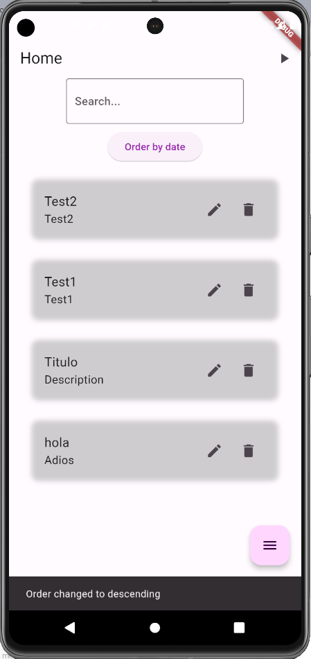
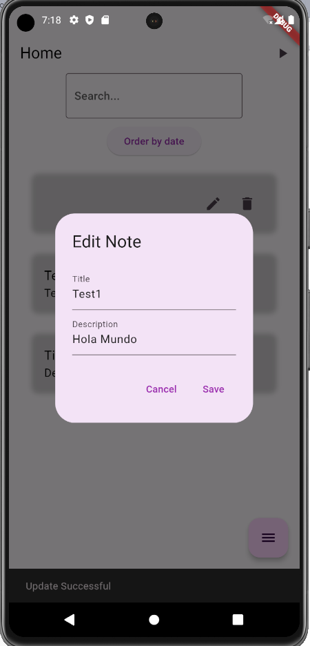

# act_6

A new Flutter project.

## Actividad 6 Queries a Firebase

- Firebase
- Querys
- Firebase UI components

## Lo que me costo mas trabajo

- Hacer la conexión en timepo real con fireCloud
- Extrael los datos correctos por id
- Evitar que se generara una nueva entrada al actualizar.

## Lo que aprendi

- [Firebase] Fireabase querys
- [Widgets] Practica de states
- [Markdown] How to build READMEs

## Screens

